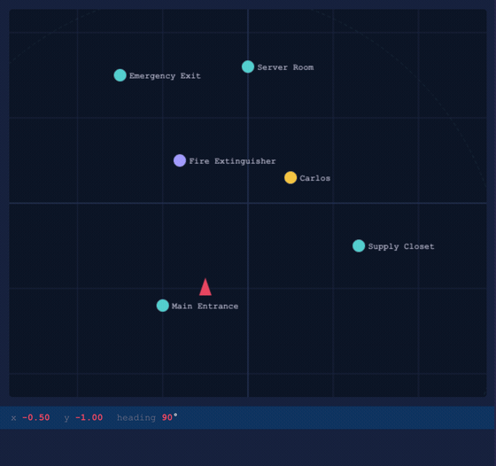
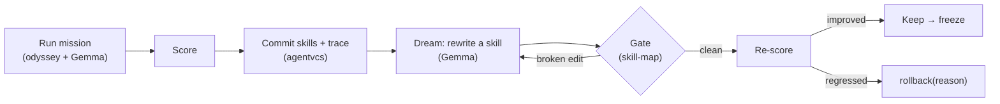

# evolving-robot

**A 2D patrol robot that rewrites its own skills — and only keeps the changes that survive a safety gate and improve its score.**


<p align="center">
  
  <br><em>The robot patrolling the simulated facility — planned and piloted by Gemma, rendered live in <code>sim2d/viewer.html</code>.</em>
</p>

One brain — **Gemma 4** (`gemma-4-26b-a4b-it`) over Google AI Studio's REST API, no GPU — orchestrated by [**odyssey**](https://github.com/lovellai-dev/odyssey), gated by [**skill-map**](https://github.com/crystian/skill-map), and versioned by [**agentvcs**](https://github.com/EvolvingAgentsLabs/agentvcs).



The robot patrols a simulated facility, dreams about its failures, rewrites a skill, and only keeps the change if it survives a semantic gate and improves its score — otherwise agentvcs rolls it back with a recorded reason.

📖 **New here?** Read the blog post — [**I let a robot rewrite its own code. Here's what stopped it from breaking everything.**](./docs/blog-post.md) See [`PLAN.md`](./PLAN.md) for the architecture.

## Requirements

| Requirement | Needed for | Notes |
|---|---|---|
| Python 3.12 | everything | `python3.12 -m venv` |
| `httpx`, `websockets` | everything | only two dependencies |
| `GEMINI_API_KEY` or `OPENROUTER_API_KEY` | Gemma planner/pilot, dream engine | scripts fall back to a scripted pilot / skip cleanly without one |
| Node ≥ 24 (`sm`) | the skill-map gate | auto-resolves an nvm-installed v24+, or set `SM_CMD` |

## Quick start

```bash
python3.12 -m venv .venv && ./.venv/bin/pip install httpx websockets
cp .env.example .env    # add GEMINI_API_KEY (AI Studio) or OPENROUTER_API_KEY
```

Then run the **full live evolution loop** — it starts the sim, runs a real mission, commits with the odyssey trace, dreams, re-scores, and restores the skills afterward (unless `--keep`):

```bash
set -a; source .env; set +a
./.venv/bin/python scripts/evolve_live.py
```

Open http://localhost:9092 to watch the robot live.

### Run each phase on its own

Every phase has a standalone acceptance script. Expand the one you want:

<details>
<summary><b>Phase 0 — brain smoke test</b> (needs an API key; skips cleanly without one)</summary>

```bash
set -a; source .env; set +a
./.venv/bin/python scripts/smoke_gemma.py
```
</details>

<details>
<summary><b>Phase 1 — drive the simulator</b></summary>

```bash
./.venv/bin/python -m sim2d.server      # terminal 1
open http://localhost:9092              # browser: live arena viewer
./.venv/bin/python scripts/drive_sim.py # terminal 2: scripted 4-point patrol
```

You should see the robot rotate + advance to each checkpoint and `observe()` report the landmarks in range, both in the terminal and animated in the viewer.
</details>

<details>
<summary><b>Phase 2 — run the patrol as an odyssey mission</b> (Gemma plans + pilots; falls back to a scripted geometry pilot with no API key)</summary>

```bash
./.venv/bin/python -m sim2d.server         # terminal 1 (+ open the viewer)
set -a; source .env; set +a                # optional: enables the Gemma pilot
./.venv/bin/python scripts/run_mission.py  # terminal 2
```

odyssey runs the mission end to end (warm-up training stub → `cpu_mock`, patrol eval → `Sim2DRunner`) and prints `overall_grade` + the eval `result_summary` (`success_rate` / `passed`).
</details>

<details>
<summary><b>Phase 3 — the skill-map gate</b> (needs <code>sm</code> on Node ≥ 24)</summary>

```bash
node --version                              # must be >= 24 for sm; `nvm install 24` if not
./.venv/bin/python scripts/gate_demo.py     # accept clean set, reject a broken @ref, accept after revert
```

Skills live in the Claude Code layout under `robot_brain/skills/.claude/skills/<name>/SKILL.md`, so `sm scan` detects them and `gate_skill()` rejects any edit that introduces a broken cross-reference, name collision, or schema violation.
</details>

<details>
<summary><b>Phase 4 — the dream engine</b> (self-rewriting skills; a mission writes a trace to <code>traces/</code> first, and the keep path needs a Gemma key)</summary>

```bash
./.venv/bin/python scripts/dream_demo.py
```

The engine reads the latest trace, asks Gemma to rewrite `patrol-route`, and gates the rewrite: a valid one is kept, a broken one is retried with skill-map's feedback and reverted. The Gemma pilot reads the active skill body, so an evolved skill actually changes behavior.
</details>

<details>
<summary><b>Phase 5 — the evolution loop</b> (agentvcs versions the skills; deterministic, offline)</summary>

```bash
./.venv/bin/python scripts/evolve_demo.py
```

`EvolutionController` commits the skills, and on each evolution: a regression triggers `rollback(reason=...)` (restoring the skill files, recording why), while a good rewrite is kept and then frozen (`crystallize`). Runs on a throwaway copy with injected scores; the live loop wires the real dream + a real mission score (see the note in the script).
</details>

## Status

All seven phases (0–6) are complete and verified end to end:

- [x] **Phase 0** — scaffolding + Gemma brain over REST (`robot_brain/gemma.py`)
- [x] **Phase 1** — 2D simulator + WebSocket transport + live browser viewer (`sim2d/`)
- [x] **Phase 2** — odyssey end to end (Gemma planner + 2D pilot + `Sim2DRunner`)
- [x] **Phase 3** — skills in Claude Code layout + skill-map gate (`robot_brain/skill_gate.py`)
- [x] **Phase 4** — dream engine: self-rewriting skills, gated + reverted (`robot_brain/dream.py`)
- [x] **Phase 5** — agentvcs commit / rollback / freeze in the evolution loop (`robot_brain/evolve.py`)
- [x] **Phase 6** — agentvcs dogfooding (`rollback(reason=)` + `odyssey` trace provider) + live loop

## Layout

| Path | What it is |
|---|---|
| `robot_brain/gemma.py` | Gemma over REST (AI Studio + OpenRouter); `generate()` matches odyssey's `TextGenerator`, `generate_full()` exposes tool-calls |
| `robot_brain/pilot.py` | `Pilot2D.act(obs, instruction) → action` — gemma (function-calling) \| scripted |
| `robot_brain/skills.py` / `skill_gate.py` | parse skills + progressive disclosure; `gate_skill()`: `sm scan --changed` + `sm check --json` → accept/reject |
| `robot_brain/dream.py` | `DreamEngine`: trace → Gemma rewrites a skill → gate → keep/revert |
| `robot_brain/evolve.py` | `EvolutionController`: agentvcs init/commit/rollback(reason)/freeze by score |
| `robot_brain/skills/.claude/skills/*/SKILL.md` | the 3 skills (skill-map layout, `@cross-refs`) |
| `sim2d/server.py` + `viewer.html` | `SimulatorHAL` (trig, no physics) + WS(:9091) + HTTP(:9092); live canvas viewer |
| `odyssey_ext/` | adapts the brain to odyssey's `TextGenerator`; `Sim2DRunner` eval runner over WS |
| `missions/patrol.mission.yaml` | training stub (`cpu_mock`) + custom eval (`Sim2DRunner`) |
| `scripts/` | one acceptance script per phase (`smoke_gemma`, `drive_sim`, `run_mission`, `gate_demo`, `dream_demo`, `evolve_demo`, `evolve_live`) |

The brain, simulator, and viewer event vocabulary are ported from [`skillos_x_robot`](https://github.com/EvolvingAgentsLabs/skillos_x_robot); everything else is new to this project.

## Providers

Set `ROBOT_PROVIDER=aistudio` (default) or `openrouter`. Both are GPU-free. `GEMMA_MODEL` defaults to `gemma-4-26b-a4b-it`, confirmed working on AI Studio via `:generateContent` (text + native function-calling). Note: gemma-4 does "thinking" by default, which leaks into the text output and bills extra tokens.

## Acknowledgments

evolving-robot stands on three open projects. This example exists to show how well they compose — full credit and thanks to their authors. The full story is in the [**blog post**](./docs/blog-post.md).

<p>
  <a href="https://skill-map.ai/"></a>
  <a href="https://odyssey.dev/"></a>
</p>

- **[skill-map](https://github.com/crystian/skill-map)** — [skill-map.ai](https://skill-map.ai/) — by **[@crystian](https://github.com/crystian)**. The semantic gate that makes the robot's self-edits safe: it models every skill/agent/command as a graph and rejects broken references, name collisions, and schema violations before an edit can land.
- **[odyssey](https://github.com/lovellai-dev/odyssey)** — by **[@SoyGema](https://github.com/SoyGema)** (lovell AI). The mission-orchestration and evaluation framework that runs and scores the robot's patrols. Its clean `TextGenerator` / `Runner` / `PlannedEvalRuntime` seams let us drop in a REST-based Gemma brain and a 2D-sim runner without touching its core.
- **[agentvcs](https://github.com/EvolvingAgentsLabs/agentvcs)** — the multidimensional version control that gives the robot a genetic memory: commit code + goal + mission trace together, roll back a regression with a recorded reason, and freeze a verified skill set.

### agentvcs dogfooding

Building this loop contributed two improvements back to the sibling [`agentvcs`](https://github.com/EvolvingAgentsLabs/agentvcs) repo (190 tests pass):

1. **`Repository.rollback(reason=...)`** — records *why* a rollback happened (an eval regression) in the durable ledger, instead of only the restored goal text.
2. **The `odyssey` trace provider** (`agentvcs/src/agentvcs/traces/odyssey.py`) — reads odyssey's native `missions.db` and normalizes a mission run (objective + per-task `result_summary` + grade) into agentvcs's message list, so commits version *what the mission actually produced*. Wired via `"trace": {"provider": "odyssey", ...}` in the controller's manifest.

## License

[Apache 2.0](./LICENSE) © Evolving Agents Labs.