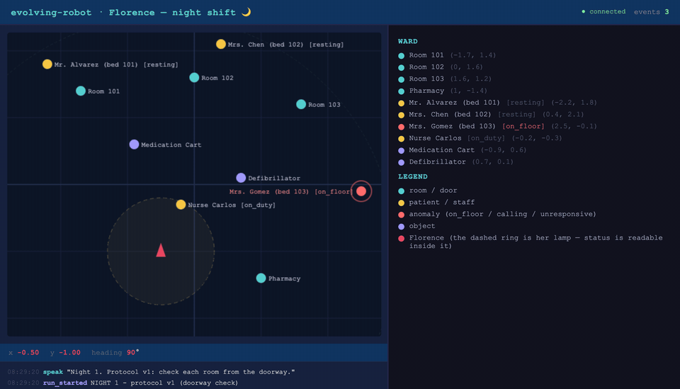
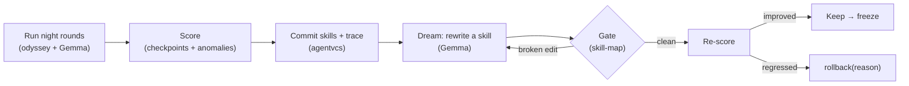
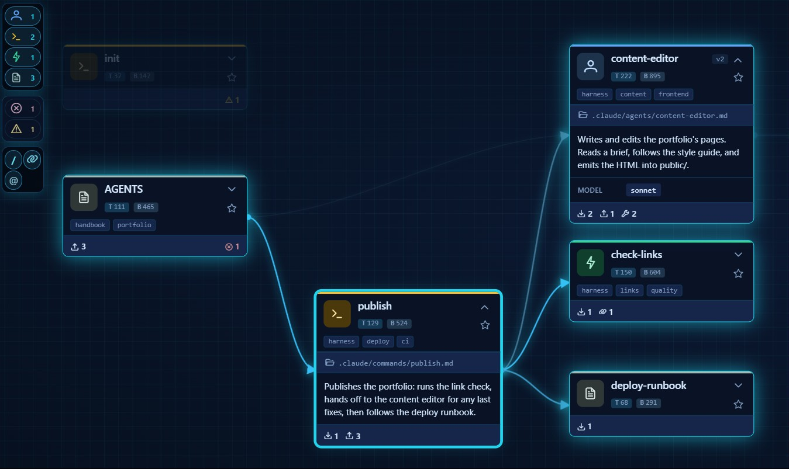
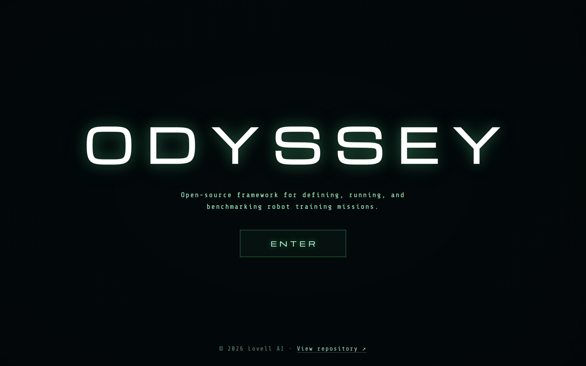

# evolving-robot — The Night Shift

**The care robots we already deploy ship with frozen behavior: the corner case they miss tonight, they will miss every night until a vendor update. This repo attacks that problem — an agent that turns tonight's incident into tomorrow's protocol, safely, reversibly, and with a full audit trail — using four open tools that already exist.**


<p align="center">
  
  <br><em>The two nights, captured live from <code>sim2d/viewer.html</code>. Night 1: protocol v1 checks Room 103 from the doorway and walks past the fall. Night 2: the evolved protocol approaches the bed, reads <code>on_floor</code>, and reports it. The dashed ring is Florence's lamp — a patient's status is only readable inside it.</em>
</p>

## The problem

Healthcare is short about **4.5 million nurses** by 2030, and the night shift is where it bites hardest: the worst staff-to-patient ratio of the day, and unwitnessed falls as the stakes. Robots are already on those wards — **Moxi** (Diligent Robotics) has made 1M+ hospital deliveries, **Aeo** (Aeolus Robotics) patrols eldercare facilities in Japan at night checking on residents, **Nurabot** (Foxconn + NVIDIA) is being validated in Taiwanese hospitals to cut nursing workload ~30%.

Every one of them ships **frozen**. Their behavior is fixed at deployment; real-time fall detection remains the documented weak point of the whole product category; and when a robot misses a corner case, a human reads the logs, patches the behavior, and redeploys. The robot never learns from its own shift.

The obvious fix — let the robot rewrite its own procedures — creates a worse problem. A self-editing agent can hallucinate a reference to a procedure that doesn't exist, quietly regress behavior that used to work, and leave no explanation behind. In a care setting, unauditable behavior change is not a feature gap; it's disqualifying.

So the real problem statement is:

> **Let an embodied agent improve its own behavior from its own failures — while guaranteeing that a broken edit can never land, a regression is automatically rolled back with the reason on record, and every protocol version is auditable.**

This repo is a small, complete, runnable proof that the tools to solve this **already exist as open source**. Florence, a 2D night-shift ward robot, misses a fallen patient, rewrites her own care protocol, and only keeps the change because it survives a safety gate and provably catches the fall.

> ⚕️ **Research demo, not a medical device.** Nothing here is validated for clinical use.

## The demo: two nights

Florence runs the night round of a small ward — Rooms 101/102/103 and the Pharmacy. Her protocol lives in three markdown skills she is allowed to rewrite, under guard. One physical rule drives the plot: **a patient's status is only readable within ~0.8 m** (her lamp). From farther away, a patient is just `unknown`.

1. **Night 1 — the incident.** Mrs. Gomez (bed 103) is on the floor, out of sight of the doorway. The authored `patient-check` protocol says: *scan from the doorway, don't enter, if a status reads `unknown` assume they're resting.* Florence executes it perfectly — and walks past the fall. odyssey scores it honestly: route done, anomaly missed → **performance 0.8, grade F**, incident on the trace.
2. **The dream.** Gemma reads its own incident trace and rewrites `patient-check` — *when a status reads `unknown`, approach the bed and read it*. skill-map gates the rewrite; agentvcs commits it with the mission trace attached.
3. **Night 2 — the verdict.** Same ward, same fall. The evolved protocol walks to the bed, reads `on_floor`, files `report_status(patient_103, on_floor)` → score recovers → keep, and a verified skill set is frozen. If the rewrite had made the round *worse*, agentvcs would `rollback(reason=...)` instead — we've watched it do exactly that on a genuinely bad rewrite, with the ledger reading `performance 0.60 < 0.80 baseline (keep_ratio 0.9); revert patient-check`.



📖 Full story in the blog post: [**My robot missed a fallen patient. Then it rewrote its own protocol.**](./docs/blog-post.md) Build log and architecture in [`PLAN.md`](./PLAN.md).

## The toolbox

Each piece of the problem is solved by one tool. None of them is exotic; the contribution of this repo is showing how cleanly they compose.

| Sub-problem | Tool | What it contributes here |
|---|---|---|
| A brain that plans, pilots, and rewrites skills — **without a GPU** | **Gemma 4** (`gemma-4-26b-a4b-it`) over [Google AI Studio](https://aistudio.google.com/)'s REST API | One commodity model is the planner (decomposes the round), the pilot (native function-calling picks each primitive), and the skill-writer (the dream). No local weights, no hardware. |
| "Better" must be **measured**, not felt | [**odyssey**](https://github.com/lovellai-dev/odyssey) (by [@SoyGema](https://github.com/SoyGema), lovell AI) | Runs every round as a mission and returns an honest scoreboard (`success_rate`, `performance_score`, letter grade). Scoring is clinical: checkpoints **and** anomalies. Medicine's outcome audit, as a framework. |
| A self-edit must **never break the protocol book** | [**skill-map**](https://github.com/crystian/skill-map) (by [@crystian](https://github.com/crystian)) — [skill-map.ai](https://skill-map.ai/) | Models the skills as a graph and hard-rejects broken `@references`, name collisions, and schema violations before an edit lands. Rejections go back to the model as feedback; a persistent failure is reverted. |
| Every change must be **reversible and auditable** | [**agentvcs**](https://github.com/EvolvingAgentsLabs/agentvcs) | Version control built for agents: a commit pins skills + goal + the odyssey mission trace as one object. `rollback(reason=…)` reverts regressions with the why on a durable ledger; `crystallize` freezes a verified protocol. The signed protocol book. |
| A world to **fail safely** in | `sim2d/` (this repo) | A 2D ward with patients, statuses readable only within the lamp radius, `report_status`, and scenario injection (`set_status`) to stage tonight's incident. Live browser viewer. |

## Requirements

| Requirement | Needed for | Notes |
|---|---|---|
| Python 3.12 | everything | `python3.12 -m venv` |
| `httpx`, `websockets` | everything | only two dependencies |
| `GEMINI_API_KEY` or `OPENROUTER_API_KEY` | Gemma planner/pilot, dream engine | scripts fall back to a scripted pilot / skip cleanly without one |
| Node ≥ 24 (`sm`) | the skill-map gate | auto-resolves an nvm-installed v24+, or set `SM_CMD` |

## Quick start

```bash
python3.12 -m venv .venv && ./.venv/bin/pip install httpx websockets
cp .env.example .env    # add GEMINI_API_KEY (AI Studio) or OPENROUTER_API_KEY
```

Then run **The Night Shift** — it starts the sim, puts Mrs. Gomez on the floor, runs night 1 (the miss), dreams, runs night 2 (the catch), and prints the keep/rollback verdict plus the agentvcs genealogy:

```bash
set -a; source .env; set +a
./.venv/bin/python scripts/night_shift.py
```

Open http://localhost:9092 to watch Florence live (the fallen patient pulses red; `report` events show in the log).

Also available: `scripts/evolve_live.py` — the same evolution loop without the staged incident, and `missions/stat_delivery.mission.yaml` — a STAT medication run (Pharmacy → Room 102) that reuses the same runner with an ordered checkpoint override.

### Run each phase on its own

Every phase has a standalone acceptance script. Expand the one you want:

<details>
<summary><b>Phase 0 — brain smoke test</b> (needs an API key; skips cleanly without one)</summary>

```bash
set -a; source .env; set +a
./.venv/bin/python scripts/smoke_gemma.py
```
</details>

<details>
<summary><b>Phase 1 — drive the simulator</b></summary>

```bash
./.venv/bin/python -m sim2d.server      # terminal 1
open http://localhost:9092              # browser: live ward viewer
./.venv/bin/python scripts/drive_sim.py # terminal 2: scripted 4-room night round
```

You should see the robot rotate + advance to each room and `observe()` report the landmarks in range — patients read `[unknown]` until the robot is inside its lamp radius (~0.8 m), which is exactly the flaw the evolution loop will exploit.
</details>

<details>
<summary><b>Phase 2 — run the night rounds as an odyssey mission</b> (Gemma plans + pilots; falls back to a scripted geometry pilot with no API key)</summary>

```bash
./.venv/bin/python -m sim2d.server         # terminal 1 (+ open the viewer)
set -a; source .env; set +a                # optional: enables the Gemma pilot
./.venv/bin/python scripts/run_mission.py  # terminal 2
```

odyssey runs the mission end to end (warm-up training stub → `cpu_mock`, rounds eval → `Sim2DRunner`) and prints `overall_grade` + the eval `result_summary`. Scoring is clinical: an episode only succeeds if every checkpoint is reached **and** every patient anomaly is correctly reported; a completed route that misses an anomaly earns partial credit (`performance_score` 0.8) and a failing grade.
</details>

<details>
<summary><b>Phase 3 — the skill-map gate</b> (needs <code>sm</code> on Node ≥ 24)</summary>

```bash
node --version                              # must be >= 24 for sm; `nvm install 24` if not
./.venv/bin/python scripts/gate_demo.py     # accept clean set, reject a broken @ref, accept after revert
```

Skills live in the Claude Code layout under `robot_brain/skills/.claude/skills/<name>/SKILL.md`, so `sm scan` detects them and `gate_skill()` rejects any edit that introduces a broken cross-reference, name collision, or schema violation.
</details>

<details>
<summary><b>Phase 4 — the dream engine</b> (self-rewriting skills; a mission writes a trace to <code>traces/</code> first, and the keep path needs a Gemma key)</summary>

```bash
./.venv/bin/python scripts/dream_demo.py
```

The engine reads the latest trace (including the `INCIDENT:` line for a missed anomaly), asks Gemma to rewrite `patient-check`, and gates the rewrite: a valid one is kept, a broken one is retried with skill-map's feedback and reverted. Both the planner and the pilot read the active skill bodies, so an evolved skill changes the plan *and* the steps.
</details>

<details>
<summary><b>Phase 5 — the evolution loop</b> (agentvcs versions the skills; deterministic, offline)</summary>

```bash
./.venv/bin/python scripts/evolve_demo.py
```

`EvolutionController` commits the skills, and on each evolution: a regression triggers `rollback(reason=...)` (restoring the skill files, recording why), while a good rewrite is kept and then frozen (`crystallize`). Runs on a throwaway copy with injected scores; the live loop wires the real dream + a real mission score.
</details>

## Status

All phases are complete and verified end to end:

- [x] **Phase 0** — scaffolding + Gemma brain over REST (`robot_brain/gemma.py`)
- [x] **Phase 1** — 2D simulator + WebSocket transport + live browser viewer (`sim2d/`)
- [x] **Phase 2** — odyssey end to end (Gemma planner + 2D pilot + `Sim2DRunner`)
- [x] **Phase 3** — skills in Claude Code layout + skill-map gate (`robot_brain/skill_gate.py`)
- [x] **Phase 4** — dream engine: self-rewriting skills, gated + reverted (`robot_brain/dream.py`)
- [x] **Phase 5** — agentvcs commit / rollback / freeze in the evolution loop (`robot_brain/evolve.py`)
- [x] **Phase 6** — agentvcs dogfooding (`rollback(reason=)` + `odyssey` trace provider) + live loop
- [x] **Phase 7** — **The Night Shift**: the healthcare scenario (patient status, `report_status`, clinical scoring, scenario injection, `scripts/night_shift.py`)

## Layout

| Path | What it is |
|---|---|
| `robot_brain/gemma.py` | Gemma over REST (AI Studio + OpenRouter); `generate()` matches odyssey's `TextGenerator`, `generate_full()` exposes tool-calls |
| `robot_brain/pilot.py` | `Pilot2D.act(obs, instruction) → action` — gemma (function-calling) \| scripted; primitives incl. `report_status`; degrades a failed Gemma step to geometry |
| `robot_brain/skills.py` / `skill_gate.py` | parse skills + progressive disclosure; `gate_skill()`: `sm scan --changed` + `sm check --json` → accept/reject |
| `robot_brain/dream.py` | `DreamEngine`: incident trace → Gemma rewrites a skill → gate → keep/revert |
| `robot_brain/evolve.py` | `EvolutionController`: agentvcs init/commit/rollback(reason)/freeze by score |
| `robot_brain/skills/.claude/skills/*/SKILL.md` | the 3 care skills: `night-rounds`, `patient-check`, `nurse-handoff` (skill-map layout, `@cross-refs`) |
| `sim2d/server.py` + `viewer.html` | `SimulatorHAL` (trig, no physics): the ward, patient `status` (readable within the lamp radius), `report_status`, `set_status` scenario injection; WS(:9091) + HTTP(:9092) |
| `odyssey_ext/` | adapts the brain to odyssey's `TextGenerator` (planner reads the skills too); `Sim2DRunner` scores checkpoints **and** anomaly reports |
| `missions/night_rounds.mission.yaml` | the night round: training stub (`cpu_mock`) + custom eval (`Sim2DRunner`) |
| `missions/stat_delivery.mission.yaml` | STAT medication run — ordered `checkpoints:` override, same runner |
| `scripts/night_shift.py` | **the flagship demo**: inject the fall → night 1 (miss) → dream → night 2 (catch) → keep/rollback → freeze |
| `scripts/` | one acceptance script per phase (`smoke_gemma`, `drive_sim`, `run_mission`, `gate_demo`, `dream_demo`, `evolve_demo`, `evolve_live`) |

The brain, simulator, and viewer event vocabulary are ported from [`skillos_x_robot`](https://github.com/EvolvingAgentsLabs/skillos_x_robot); everything else is new to this project.

## Providers

Set `ROBOT_PROVIDER=aistudio` (default) or `openrouter`. Both are GPU-free. `GEMMA_MODEL` defaults to `gemma-4-26b-a4b-it`, confirmed working on AI Studio via `:generateContent` (text + native function-calling). Notes: gemma-4 does "thinking" by default, which leaks into the text output and bills extra tokens; on the free tier, throttling can stall calls mid-mission — the pilot degrades a failed step to its geometric fallback and the runner retries an episode planner-less, so a round survives transient API weather.

## Acknowledgments

evolving-robot stands on three open projects. This example exists to show how well they compose — full credit and thanks to their authors. The full story is in the [**blog post**](./docs/blog-post.md).

<p>
  <a href="https://skill-map.ai/"></a>
  <a href="https://odyssey.dev/"></a>
</p>

- **[skill-map](https://github.com/crystian/skill-map)** — [skill-map.ai](https://skill-map.ai/) — by **[@crystian](https://github.com/crystian)**. The semantic gate that makes the robot's self-edits safe: it models every skill/agent/command as a graph and rejects broken references, name collisions, and schema violations before an edit can land.
- **[odyssey](https://github.com/lovellai-dev/odyssey)** — by **[@SoyGema](https://github.com/SoyGema)** (lovell AI). The mission-orchestration and evaluation framework that runs and scores the robot's rounds. Its clean `TextGenerator` / `Runner` / `PlannedEvalRuntime` seams let us drop in a REST-based Gemma brain and a 2D-sim runner without touching its core.
- **[agentvcs](https://github.com/EvolvingAgentsLabs/agentvcs)** — the multidimensional version control that gives the robot a genetic memory: commit code + goal + mission trace together, roll back a regression with a recorded reason, and freeze a verified skill set. Its ecosystem includes **[nanoLoop](https://github.com/ismaelfaro/nanoLoop)** by **[@ismaelfaro](https://github.com/ismaelfaro)** (also an agentvcs collaborator), the minimal agent loop that acts as the live reconciliation brain behind agentvcs's multidimensional `merge --reconcile`.

### agentvcs dogfooding

Building this loop contributed two improvements back to the sibling [`agentvcs`](https://github.com/EvolvingAgentsLabs/agentvcs) repo:

1. **`Repository.rollback(reason=...)`** — records *why* a rollback happened (an eval regression) in the durable ledger, instead of only the restored goal text.
2. **The `odyssey` trace provider** — reads odyssey's native `missions.db` and normalizes a mission run (objective + per-task `result_summary` + grade) into agentvcs's message list, so commits version *what the mission actually produced*. Wired via `"trace": {"provider": "odyssey", ...}` in the controller's manifest. If the installed agentvcs doesn't carry the provider, `EvolutionController` degrades gracefully to trace-less commits (and says so).

## License

[Apache 2.0](./LICENSE) © Evolving Agents Labs.
